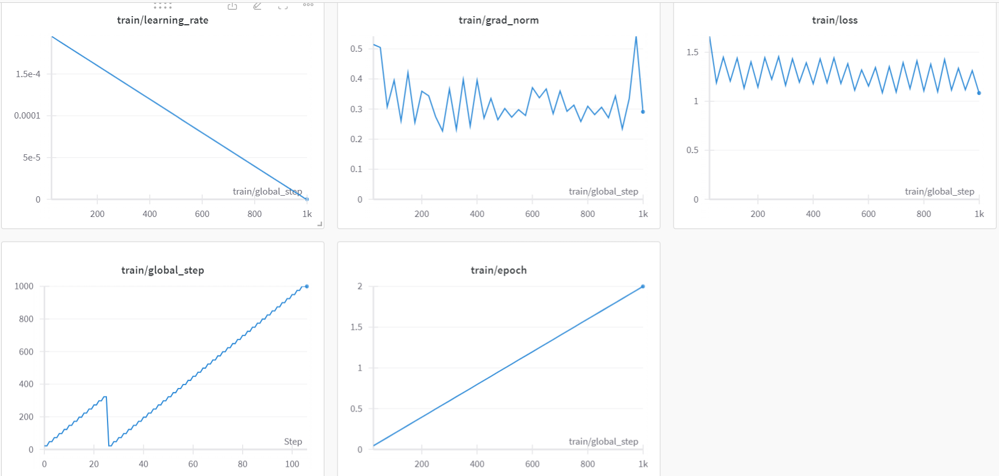
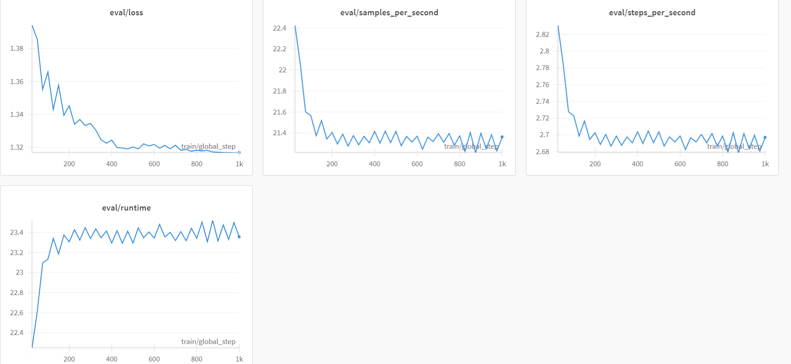

# Fine Tune Large Language Model (LLM) on a Custom Dataset with QLoRA

## Introduction

Fine-tuning Using a smaller, domain-specific dataset, LLM entails retraining an existing model that has already learned patterns and features from a large dataset. When we talk about "LLM Fine-Tuning," we're talking about a "Large Language Model," like OpenAI's GPT series. This method is important since it saves a lot of time and processing power when training a big language model from scratch. By leveraging the pre-trained model's incorporated current knowledge, good performance on certain tasks can be achieved with significantly less data and processing resources.

Below are some of the key steps involved in LLM Fine-tuning:

1. Select a pre-trained model: For LLM Fine-tuning first step is to carefully select a base pre-trained model that aligns with our desired architecture and functionalities. Pre-trained models are generic purpose models that have been trained on a large corpus of unlabeled data.
2. Gather relevant Dataset: Then we need to gather a dataset that is relevant to our task. The dataset should be labeled or structured in a way that the model can learn from it.
3. Preprocess Dataset: Once the dataset is ready, we need to do some preprocessing for fine-tuning by cleaning it, splitting it into training, validation, and test sets, and ensuring it’s compatible with the model on which we want to fine-tune.
4. Fine-tuning: After selecting a pre-trained model we need to fine tune it on our preprocessed relevant dataset which is more specific to the task at hand. The dataset which we will select might be related to a particular domain or application, allowing the model to adapt and specialize for that context.
5. Task-specific adaptation: During fine-tuning, the model’s parameters are adjusted based on the new dataset, helping it better understand and generate content relevant to the specific task. This process retains the general language knowledge gained during pre-training while tailoring the model to the nuances of the target domain.

## Fine tuning Methods

1. Full Fine Tuning (Instruction fine-tuning): By training a model on examples that direct its query responses, instruction fine-tuning is a technique to improve a model's performance across a variety of tasks. Selecting the right dataset is essential and should be based on the particular activity at hand, such translation or summarization. By updating all of the model weights, this method—known as comprehensive fine-tuning—creates a new version with enhanced capabilities. But like pre-training, it requires enough memory and processing power to manage the storing and processing of gradients, optimizers, and other training components.
2. A type of instruction fine-tuning that is far more effective than full fine-tuning is called parameter efficient fine-tuning (PEFT). Training a language model requires a large amount of computer power, particularly for complete LLM fine-tuning. Memory allocation is a problem for simple hardware because it is needed not just to store the model but also for important parameters during training. In order to overcome this, PEFT "freezes" the remaining parameters by only changing a portion of them. As a result, there are fewer trainable parameters, which helps control memory requirements and avoid forgetting anything important. In contrast to complete fine-tuning, PEFT preserves the initial LLM weights, preventing the loss of previously acquired knowledge. This method works well for managing storage problems while fine-tuning for several processes. It is possible to achieve parameter efficient fine-tuning in a number of methods: Low-Rank Adaptation LoRA & QLoRA are the most widely used and effective.

## LORA

LoRA is an enhanced fine-tuning technique in which two smaller matrices (rank of matrix) that roughly correspond to the bigger matrix are fine-tuned rather than all the weights that make up the weight matrix of the pre-trained large language model. The LoRA adaptor is made up of these matrices. The pre-trained model is then utilized for inference with this adjusted adaptor fed into it.

Following LoRA fine-tuning for a particular job or use case, the result is an original LLM that remains intact and the appearance of a significantly smaller “LoRA adapter,” which frequently represents a single-digit percentage of the original LLM size (measured in MBs instead of GBs).

During inference, the LoRA adapter must be combined with its original LLM. The advantage lies in the ability of many LoRA adapters to reuse the original LLM, thereby reducing overall memory requirements when handling multiple tasks and use cases.

## QLORA

An improved memory-efficient version of LoRA is called QLoRA. By additionally quantizing the weights of the LoRA adapters (smaller matrices) to a lower precision (e.g., 4-bit instead of 8-bit), QLoRA goes beyond LoRA. This further minimizes the need for storage and memory footprint. Unlike LoRA, which uses 8-bit weights, QLoRA loads the pre-trained model into GPU memory using quantized 4-bit weights. Yet, QLoRA is still as effective as LoRA, even with this decrease in bit precision.

## Environment Setup - About Libraries

1. Bitsandbytes: An excellent package that provides a lightweight wrapper around custom CUDA functions that make LLMs go faster — optimizers, matrix multiplication, and quantization. In this tutorial, we’ll be using this library to load our model as efficiently as possible.
2. transformers: A library by Hugging Face (🤗) that provides pre-trained models and training utilities for various natural language processing tasks.
3. peft: A library by Hugging Face (🤗) that enables parameter-efficient fine-tuning.
4. accelerate: Accelerate abstracts exactly and only the boilerplate code related to multi-GPUs/TPU/fp16 and leave the rest of your code unchanged.
5. datasets: Another library by Hugging Face (🤗) that provides easy access to a wide range of datasets.
6. einops: A library that simplifies tensor operations.

## Dataset Information

Numerous datasets are available for fine-tuning the model. In this instance, we will utilize the DialogSum DataSet from HuggingFace for the fine-tuning process. DialogSum is an extensive dialogue summarization dataset, featuring 13,460 dialogues along with manually labeled summaries and topics.

## About LLM used

Phi-2 is a Transformer with 2.7 billion parameters. It was trained using the same data sources as Phi-1.5, augmented with a new data source that consists of various NLP synthetic texts and filtered websites (for safety and educational value). When assessed against benchmarks testing common sense, language understanding, and logical reasoning, Phi-2 showcased a nearly state-of-the-art performance among models with less than 13 billion parameters.

## Quantization Parameters

To load the model, we need a configuration class that specifies how we want the quantization to be performed. We’ll be using BitsAndBytesConfig to load our model in 4-bit format. This will reduce memory consumption considerably, at a cost of some accuracy.

compute_dtype = getattr(torch, "float16")
bnb_config = BitsAndBytesConfig(
        load_in_4bit=True,
        bnb_4bit_quant_type='nf4',
        bnb_4bit_compute_dtype=compute_dtype,
        bnb_4bit_use_double_quant=False,
    )

## PEFT Configs

Rank =32
LORA Alpha=32
Target Modules=q_proj,k_proj,v_proj,dense
LORA Dropout=0.05
Task Type=Causal LM

Rank (r) hyper-parameter, which defines the rank/dimension of the adapter to be trained. r is the rank of the low-rank matrix used in the adapters, which thus controls the number of parameters trained. A higher rank will allow for more expressivity, but there is a compute tradeoff.

LORA alpha here is the scaling factor for the learned weights. The weight matrix is scaled by alpha/r, and thus a higher value for alpha assigns more weight to the LoRA activations.

## Model Training Parameters

warmup_steps=1,
per_device_train_batch_size=1, # Training Batch size
gradient_accumulation_steps=4, # Specifies the steps after which model accumulates all the gradients and retrains the network using backpropagation
max_steps=1000, # Overrides total number of epochs
learning_rate=2e-4, # Rate at which model learns the features from training dataset
optim="paged_adamw_32bit", # Standard optimizer
logging_steps=25, # Logging
logging_dir="./logs",
save_strategy="steps",
save_steps=25, # Saving checkpoint
evaluation_strategy="steps", 
eval_steps=25, # Evaluate trained models
do_eval=True,
gradient_checkpointing=True,
report_to="wandb", # Save training metrics to WANDB
run_name = "AarushiSinha/Phi2-fine-tuned",
overwrite_output_dir = 'True',
group_by_length=True,

## Model Training Performance

global_step=1000, training_loss=1.2568040847778321, metrics={'train_runtime': 1944.0332, 'train_samples_per_second': 2.058, 'train_steps_per_second': 0.514, 'total_flos': 1.850993530739712e+16, 'train_loss': 1.2568040847778321, 'epoch': 2.001000500250125
Step Training Loss Validation Loss
25	1.397800	1.333857
50	1.116100	1.350984
75	1.393800	1.334511
100	1.140400	1.354389
125	1.391700	1.330908
150	1.078800	1.354294
175	1.364500	1.330168
200	1.088900	1.339763
225	1.405100	1.328655
250	1.170400	1.334475
275	1.417700	1.329436
300	1.112700	1.333537
325	1.404700	1.324971
350	1.195100	1.324806
375	1.392700	1.322739
400	1.179700	1.324676
425	1.432600	1.320145
450	1.190400	1.319838
475	1.441800	1.319327
500	1.182300	1.320529
525	1.383600	1.319332
550	1.113800	1.322372
575	1.320500	1.321091
600	1.156500	1.322022
625	1.344700	1.319742
650	1.088200	1.321404
675	1.353200	1.319358
700	1.095900	1.321509
725	1.393600	1.318529
750	1.130300	1.319043
775	1.412000	1.317904
800	1.108300	1.318485
825	1.378700	1.318102
850	1.099700	1.318476
875	1.426100	1.317419
900	1.116100	1.317294
925	1.337400	1.317082
950	1.119500	1.317067
975	1.313800	1.316914
1000	1.083200	1.316937

## Model Weights saving and inferencing

Model Weights are saved in output directory and final checkpoint-checkpoint 1000- is loaded with base model at the time of inferencing. The base model is loaded with the same quantization config as the previous base model used for finetuning. 

This method behaves much better than transformers merge_and_unload() as merge and unload function merges the base model with the LORA weights. Since the LORA weights are far lesser in number (only 1.36%) Model tends to not respond with the learned knowledge and uses its pre trained knowledge during inferencing.

Loading the saved LORA weights on top of quantized base model ensures that model uses the fine tuned knowledge first.

